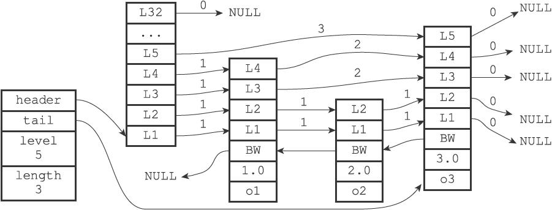

## Redis数据结构

### SDS

sds是String类型的承载数据结构，同时也是Key的承载数据结构。

#### 结构构成

sds结构由三个部分组成。

free - 标识sds对象中未使用的空间。

len - 标识sds对象中已使用的空间。

buf - 字符数组，用来存储内容，以\0结尾。

如此设计的意义：

1.将获取字符长度的复杂度变成O（1）

2.能够在内存重分配时提高速度，通过添加free字段，在进行扩容或者修改时，能够很快的获知是否需要重分配。

#### 空间预分配

空间预分配用于优化SDS的字符串增长操作：当SDS的API对一个SDS进行修改，并且需要对SDS进行空间扩展的时候，程序不仅会为SDS分配修改所必须要的空间，还会为SDS分配额外的未使用空间。

额外分配的空间，将根据修改后的长度来决定，如果修改后的长度小于1M，那么预分配的空间等于修改后的长度，此时free = len；若修改后的长度大于1M，那么预分配的空间将等于1M。

#### 惰性空间释放

当对SDS字符串进行缩短的操作时，那么Redis并不会马上释放掉未使用的内存空间，而是使用free字段进行标明，避免后续再度因为扩容而导致了重新分配。

### 链表

链表作为列表键的主要实现手段，提供了高效的访问效率。

#### 结构构成

List结构主要由以下三个部分构成。

head - 头节点，结构类型为ListNode

tail - 尾节点，结构类型为ListNode

len - list的长度

list还包含了一些方法，用于复制list、释放list等

ListNode结构主要由三部分构成

preNode - 上一个节点

nextNode - 下一个节点

value - 节点的值

可以看出，链表是双向链表，且保存了头尾节点和长度，那么在获取头尾节点和链表长度时，复杂度都为O（1）。

### 字典

字典在Redis中使用很广泛，比如Redis的数据库就是使用字典做为底层实现的，在对数据库进行增删改查操作时，也是构建在对字典的操作上的，例如执行命令“SET msg hello”时，会在数据库中创建一个键为msg，值为hello的键值对，这个键值对就保存在字典中。字典还是哈希键的底层实现之一（另一个是压缩列表），当哈希键中的键值对较多或键值对中的元素都是比较长的字符串时，Redis会使用字典作为哈希键的底层实现。

哈希表结构主要由以下几个部分组成（dictHt）

table - 哈希表数组，其中的数据使用dictEntry结构来构成

size - long类型，哈希表的大小

sizemask - 哈希表大小掩码，用于计算索引值，总是等于size-1

used - long类型，表明该hash表已有节点的数量

dictEntry结构组成如下

key - 键

value - 值，可以是一个指针，也可以是一个unit64_t整数或int64_t整数

next - 下一个节点。

Redis中使用的字典（dict），是对哈希表的再一次封装。

其结构如下：

type - 类型的特定函数，指向一个dictType结构的指针，每个ditcType保存了一簇用于操作特定类型键值对的函数。

privdata - 私有数据，保存了需要传给type中函数的可选参数。

ht[2] - 哈希表，类型为dictHt，包含了两个项的数组，两个项都是哈希表，一般情况下只会使用ht[0]的哈希表，ht[1]只会在对ht[0]进行rehash时使用，有点类似于jvm中新生代两个survivor区，两个区正常情况下只会使用一个。

rehashidx - rehash的索引，当rehash不在进行中时，值为-1。

#### 哈希算法

当要将一个新的键值对添加到字典里面时，程序需要先根据键值对的键计算出hash值和索引值，然后再根据索引值，将包含新键值对的哈希表节点放到哈希表数组的指定索引上面。

Redis使用的哈希算法为MurmurHash2.这种算法的优点是，即使输入的键是有规律的，算法仍然能够提供很好的随机分布性，且计算速度非常快。

MurmurHash2算法在其他开源项目中也有出现，比如nginx、hadoop。

#### 键冲突解决方法

当有两个或者多个键被分配到哈希表数据的同一个索引上时，则表示出现了键冲突。

Redis的哈希表使用的是链地址法来解决键冲突，每个哈希表节点都有一个next指针，因此可以用next指针构成一个单向的链表，当出现键冲突的情况时，将新的节点添加至链表尾部即可。

#### rehash

为了让哈希表的负载因子维持在一个合理的范围内，当哈希表的键值对数量太多或者太少时，程序需要对哈希表的大小进行相应的扩展或者收缩。

##### rehash的步骤

1.为字典的ht[1]哈希表分配空间，这个哈希表的大小取决于要执行的操作，以及ht[0]当前包含的键值对数量。如果是执行扩展操作，那么ht[1]大小会是h[0]大小乘2的2次幂，如果是执行收缩操作，那么ht[1]的大小会是ht[0]大小的2次幂。

2.将保存在ht[0]中的所有键值对rehash到ht[1]上面

3.当rehash全部结束，将ht[0]中的数据清空，释放内存。

4.将ht[0]的指针指向ht[1]中的哈希表，并在ht[1]中新建一个空白的哈希表，并为下一次rehash做准备。

##### rehash的执行条件

rehash会在两种情况下进行

1.当负载因子大于等于1，且服务器没有在执行bgsave操作或者bgrewriteaof命令

2.当负载因子大于等于5，且服务正在执行bgsave或bgrewriteaof命令。

3.当负载因子小于0.1时，进行rehash以达到收缩的目的。

负载因子 = ht[0]哈希表已有节点数量/ht[0]哈希表的大小

##### 渐进式rehash

redis字典进行rehash时，并不是一次性、集中的完成的，而是分多次、渐进性的完成的。

字典中的rehashidx为rehash的索引，当其值为0时，表示rehash工作正式开始，在rehash期间，每次对字典执行添加、删除、查找或者更新操作时，除了执行指定操作以外，还会顺便把ht[0]哈希表在rehashidx索引上的所有键值对rehash到ht[1]，单个索引的rehash完成后，rehashidx属性增一，当所有索引都rehash完成，rehashidx值重新设置为-1。

同时，为了避免在rehash期间，出现数据不同的情况，在rehahs期间，对字典进行查找、删除、修改时，操作会同时在两个哈希表中进行，查找操作也会在两个哈希表中进行，先查ht[0]，在未查找到数据的情况下，再查ht[1]，对字典进行新增操作时，键值对会直接保存到ht[1]中，ht[0]不会进行新增操作。

### 跳表

跳跃表（skiplist）是一种有序数据结构，它通过在每个节点中维持多个指向其他节点的指针，从而达到快速访问节点的目的。跳跃表支持平均O（logN）、最坏O（N）复杂度的节点查找，还可以通过顺序性操作来批量处理节点。Redis使用跳跃表作为有序集合键的底层实现之一，如果一个有序集合包含的元素数量比较多，又或者有序集合中元素的成员（member）是比较长的字符串时，Redis就会使用跳跃表来作为有序集合键的底层实现。

跳表主要的结构有两个，包括跳表本身的zskipList和跳表节点的zskipNode。

其中，zskipList的结构主要由以下几个部分构成

header - 跳表的头节点，类型为zskipNode

tail-跳表的尾节点，类型为zskipNode

level - 当前跳表中最大的层数。

length - 记录跳表的长度。

zskipNode的结构主要由以下几个部分构成

level - 层，由zskipLevel组成的数组，如上图所示，L1、L2等表示每个层级，每个层级中包含两个属性，前进指针和跨度，前进指针用于指向尾端的下一个节点，而跨度，则用于表示下一个节点与当前节点的距离，图中连线的数字即为跨度。

backward-后退指针，指向节点的上一个节点，用于后退时使用。

score - 分值，节点中的1.0、2.0等即为当前节点的分值，节点按照分值从小到大排列。

obj - 各个节点保存的对象。

遍历过程中，level层中的跨度会相加，结果为查询到的节点的score值。

### 整数集合

整数集合（intset）是集合键的底层实现之一，当一个集合只包含整数值元素，并且这个集合的元素数量不多时，Redis就会使用整数集合作为集合键的底层实现。

整数集合的数据结构intset由以下几个部分构成。

encoding - 编码格式，可能值为INTSET_ENC_INT16、INTSET_ENC_INT32、INTSET_ENC_INT64等，表明了每个整数所占的长度，是根据集合中，最大数据决定的，例如，集合中最大的数为65536，65536转化为二进制以后长度为32，则encoding的值为INTSET_ENC_INT32，每个整数的长度都会变更为32位。则int[]所占的总长度为32*length。**编码只能升，不会降**。

length - 集合的长度。

int[] - 集合数据，用于真正保存集合中的数据。

### 压缩列表

压缩列表（ziplist）是列表键和哈希键的底层实现之一。当一个列表键只包含少量列表项，并且每个列表项要么就是小整数值，要么就是长度比较短的字符串，那么Redis就会使用压缩列表来做列表键的底层实现。压缩列表是Redis为了节约内存而开发的，是由一系列特殊编码的连续内存块组成的顺序型（sequential）数据结构。一个压缩列表可以包含任意多个节点（entry），每个节点可以保存一个字节数组或者一个整数值。

压缩列表由以下几个部分构成

zlbytes - 记录整个压缩列表所占的字节数。

zltail - 压缩列表最后一个节点到起始点的字节数，通过起始地址加上zltail的值，可以快速跳转到尾节点。

zllen - 记录压缩列表中节点的数量，当zllen小于65536时，它表示的就是压缩节点的数量，当zllen大于等于65536时，压缩列表的节点数，需要遍历才能得知。

entryX - 压缩列表的真正节点，长度和数量不定。每个节点都可以是字节数组或者整数值。每个压缩列表节点都由previous_entry_length、encoding、content三个部分组成。previos_entry_length表示上一个节点的长度，encoding表示该节点的编码格式，content表示该节点的真正内容。

zlend - 最后的结尾标识符，用于表示列表的结尾。

//TODO 压缩列表的连锁更新。111111

### 参考资料

https://i6448038.github.io/2019/12/01/redis-data-struct/  

《Redis设计与实现》

