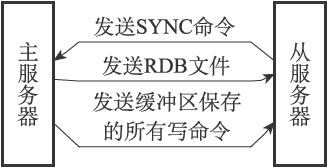

### 前言

Redis中，当主从服务器为了保证数据的一致性，会在主从服务器数据不一致时，使用主从复制操作来保证一致。

### 旧版复制

Redis旧版本中（2.8以前），Redis的主从复制主要包括两个操作，同步和命令传播。

#### 同步

同步操作用于将从服务器的数据库状态更新至主服务当前的数据库状态。

##### 大致原理

当从服务器执行SLAVEOF命令，要求从服务器成为主服务器的从机时，从服务器会首先执行同步操作，从服务器通过向主服务发送**SYNC**命令来完成，SYNC命令的执行步骤如下：

1.从服务器发送SYNC命令。

2.收到SYNC命令的主服务器执行BGSAVE命令，在后台生成RDB文件，并使用一个**缓冲区**记录一个从现在开始执行的所有写命令。

3.当主服务器BGSAVE命令执行完成，主服务器会将RDB文件发送给从服务器，从服务器通过RDB文件将数据库更新至主服务器执行BGSAVE命令时的数据库状态。

4.主服务器将缓冲区中的写命令发送给从服务器，从服务器执行这些命令，将自己的数据进一步更新。

#### 命令传播

在同步操作执行完成之后，主从服务器的数据已经一致了，当主服务器再接收到写命令时，为了保证主从服务器的一致性，主服务器会将命令传播至从服务器。

##### 大致原理

当主服务器接收到写命令时，主服务器执行完命令个后，会将命令发送给从服务器。

#### 旧版复制的缺陷

##### 断线重连后的数据恢复

假设现在主从服务器数据正常，当从服务器A出现网络波动，导致主从服务器断线，此时的主服务器继续接受命令并执行，然后发给其他正常的服务器，从服务器A过一段时间重新连接到主服务器后，为了保证数据正常，再次发起复制请求，此时如果断线时间如果并不长，那么从服务器A与主服务器之间的数据差异其实并不大，但是旧版复制也只能通过同步操作，完整的复制整个数据库来保证数据一致。

##### SYNC命令的资源消耗

因为SYNC命令需要执行BGSAVE命令来生成RDB文件，这个操作会消耗主服务大量的CPU、内存、IO资源，同时发送RDB文件到从服务器也会消耗大量的带宽和流量。

### 新版复制

新版复制为了解决旧版复制在断线重连后效率低下的问题，从Redis2.8版本开始，使用PSYNC命令替代SYNC命令执行复制时的同步操作。

#### 完整重同步

当主从服务器初次进行复制时，会采用完整重同步的方式进行复制，步骤与SYNC命令基本一致，都是通过RDB文件实现。

#### 部分重同步

当出现断线重连时，当**满足一定条件**时，主服务器可以将断线期间执行的写命令发送给从服务器，从服务器执行这些命令即可。

##### 实现方式

部分重同步的功能实现由以下三个部分构成，

1.主从服务器的复制偏移量

​	进行复制的双方各自保存一份复制偏移量，复制偏移量基于传播的数据字节数来定的。当断线重连时，程序会根据主从服务器的偏移量对比来判断主从服务器的数据是否一致，如果偏移量一致，那么两者处于一致状态，否则为不一致状态。

2.主服务器的复制积压缓冲区

​	复制积压缓冲区是一个由**主服务器**维护的一个FIFO的队列，默认大小为1MB，所有写命令在执行完成后，都会放入缓冲区中，当缓冲区满了以后，最先放入缓冲区的命令会被弹出。

​	复制缓冲区会为队列中的每个字节记录响应的复制偏移量，当从服务器通过PSYNC命令将自己的复制偏移量发送到主服务器时，主服务器会根据偏移量来决定如何执行复制操作，如果偏移量的值小于缓冲区队列中最小的偏移量，则表示断线后有部分数据已经无法从缓冲区获取，那么需要执行完整同步操作；如果偏移量的值大于缓冲区最小的偏移量的值，则说明断线期间的数据都可以通过缓冲区获取，那么主服务器只需要将缓冲区中大于偏移量的命令发送给从服务器即可。

3.服务器的运行id

​	每个服务器，无论主从，在启动时，都会生成一个十六进制的字符串id，用于唯一标识每个服务器。

​    因为Redis在主服务器宕机时，会通过重新[选举](./2021-05-29-Redis主从复制)的方式重新选择一个新的主服务器，为了保证数据的一致性，从服务器发送PSYNC命令时，会将上一次复制的主服务器ID一起发送给主服务器，主服务会根据ID是否等于当前主服务器来决定是否需要完整重同步。

#### 心跳检测

在命令传播阶段，从服务器默认会以每秒一次的频率向主服务器发送命令

REPLCONF ACK ＜replication_offset＞ ，其中replication_offset为从服务器当前的复制偏移量。

#### 心跳检测的作用

1.检测主从服务器的网络连接

​	主服务器执行INFO REPLICATION命令，在lag一栏中可以列出从服务器最后一次向主服务器发送REPLCONF ACK命令距离现在有多少秒，如果超过阈值，则表明主从服务器之间出现了故障。

2.附注实现min-slaves选项

​	主服务器判断是否安全的设置：

​	min-slaves-to-write X  

​    min-slaves-max-lag Y

​	min-slaves-max-lag设置了上一次发送REPLCONF ACK命令距离现在的秒数如果超过了Y以后，会被标记为失去连接，min-slaves-to-write则表示必须存在X个从服务器不处于失去连接状态。

3.检测命令丢失

​	如果因为网络故障，主服务器传播给从服务器的写命令在半路丢失，那么当从服务器向主服务器发送REPLCONF ACK命令时，主服务器将发觉从服务器当前的复制偏移量少于自己的复制偏移量，然后主服务器就会根据从服务器提交的复制偏移量，在复制积压缓冲区里面找到从服务器缺少的数据，并将这些数据重新发送给从服务器。

### 参考资料

Redis设计与实现