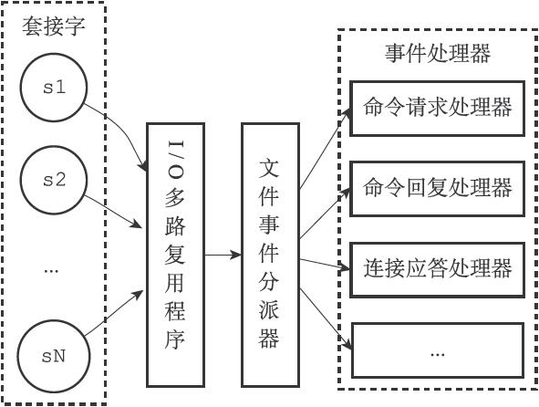

### 简介

Redis服务器是一个时间驱动程序，服务器需要处理两种类型的事件，分别是文件事件和时间事件。

### 文件事件

Redis服务器与客户端通过套接字(socket)进行连接，而文件事件就是服务器对套接字操作的抽象，服务器与客户端的通信会产生响应的文件事件，而服务器则通过监听并处理这些事件来完成一系列网络通信操作。

#### 文件事件处理器

Redis基于Reactor模式开发了自己的网络事件处理器，这个处理器被称为文件事件处理器。

文件事件处理器使用I/O多路复用程序来监听多个套接字，并根据套接字目前执行的任务来为套接字关联不同的事件处理器。

当被监听的套接字准备好执行连接应答（accept）、读取（read）、写入（write）、关闭（close）等操作时，与操作相对应的文件事件就会产生，这时文件事件处理器就会调用套接字之前关联好的事件处理器来执行这些事件。

##### 文件事件处理器的构成

文件事件处理器主要包括四个部分，分别是套接字、I/O多路复用程序、文件事件分派器（dispatcher）、事件处理器。

套接字：用于保持客户端和服务器之间的连接，并执行应答、读取、写入、关闭等操作，Redis会根据这些操作产生不同的文件事件。

I/O多路复用程序：负责监听多个套接字，并向文件事件分派器传送产生了事件的套接字。当多个文件事件并发出现时，I/O多路复用程序会将所有产生事件的套接字放到一个队列中，通过这个队列，有序且同步的一个一个的向文件事件分派器发送套接字。

文件事件分派器：接受I/O多路复用程序传来的套接字，并根据套接字中产生的时间类型，调用对应的事件处理器。

事件处理器：实际上是一系列预先定义的函数，定义了某些事件发生时，服务器应该执行的动作。

##### I/O多路复用

Redis中的I/O多路复用程序的所有功能都是通过包装常见的select、epoll、evport和kqueue这些函数库来实现，Redis在编译时会自动选择系统中性能最高的I/O多路复用函数库来实现，例如在Linux下会选择epoll，MacOs下会选择kqueue、Solaries会选择evport。

##### 文件事件的处理器

主要有命令请求处理器、连接应答处理器、命令回复处理器、复制处理器这几种类型。

1.连接应答处理器

​	用于对连接服务器监听套接字的客户端进行应答，当Redis服务器初始化时，连接应答处理器会和服务器监听套接字的AE_READABLE事件关联起来，当有客户端用connnet函数连接服务器时，套接字会产生AE_READABLE事件，引发连接应答处理器执行，并执行对应的操作。

2.命令请求处理器

​	负责从套接字中读取客户端发送的命令请求内容，并执行对应的操作。

3.命令回复处理器

​	当服务器执行命令完成后，命令回复处理器会负责将结果回复给客户端。

4.复制处理器

​	用于主从服务器进行复制操作时，将数据复制给从服务器。

### 时间事件

主要分为两类，定时事件和周期性事件。

#### 时间事件的构成

时间事件主要由以下三个属性构成：

1.id，服务器为时间事件创建的全局唯一id，为递增的。

2.when，毫秒精度的UNIX时间戳，记录了时间事件的到达时间。

3.timeProc，时间事件处理器，一个函数，当时间事件到达时，调用相应的处理器来处理事件。

##### 实现原理

服务器将所有的时间事件放在一个无序链表中，每当时间事件执行器运行时，它就遍历整个链表，查找所有已到达的时间事件，并调用相应的事件处理器。

##### serverCron函数

正常模式下的Redis只有serverCron这一个时间事件，它承担了Redis很多的一些工作，主要包括以下这些内容：

1.更新服务器的各类统计信息，比如时间、内存占用、数据库占用等。

2.清理过期键值对

3.关闭和清理连接失效的客户端

4.尝试进行AOF或者RDB持久化操作。

5.如果是主服务器，对从服务器进行定期同步。

6.如果是集群模式，对集群进行定期同步和连接测试。

serverCron函数默认是每秒运行十次，平均100毫秒运行一次，可以通过修改redis.conf中的hz选项来自定义间隔，hz为运行间隔，通常为1-500，越小则运行频率越高。

### 参考资料

Redis设计与实现