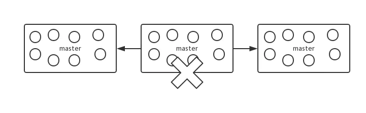

### 简介

Redis官方提供的集群解决方案中，为了实现数据的分片，采用了slot的方式来实现，它本身也是基于hash算法来做的，只是与一致性hash有些不同。

#### slot算法

redis cluster中定义了固定的16384个hash slot，每个slot会绑定一个master节点，每个master会对应多个slot。

当有key需要操作时，首先对计算key的CRC16值，CRC16算法会均匀的分配key值，然后对16384进行取模，即可获取到key对应的slot。

#### 当出现服务器数量变更

与一致性hash不同，key运算后的结果因为并没有直接对应机器，而是通过对应slot，当机器数量出现了变化，也只是slot和机器之间的对应关系出现了变化。

