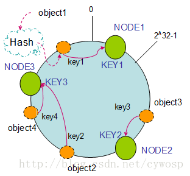

### 简介

当采用分布式数据存储时，为了避免将数据过于集中在某些表或者库中，通常会将数据按照特定的规则进行分布存储，例如mysql分库，通常会使用id求hash（也可以不求）后与机器数量进行取模，取模后的结果对应库的编码。但这种情况会存在一定的问题，假设此时添加了机器或者集群中有机器宕机了，此时就会导致机器数量出现了变化，原有数据需要重新分片，才能保证原先的分片算法没有问题，否则会导致数据无法正常查询，但是重新分片比如导致服务器无法对外提供服务，服务的可用性就会降低。

为了解决上面的问题，一致性hash诞生了，虽然一致性hash无法保证所有机器都不需要重新hash，但是它可以将影响降低到最小。

#### hash环

一致性hash算法也是采用取模的方法，只是不同于对机器数量取模，一致性hash是对2的32次方取模，一致性hash将整个Hash值组成一个虚拟的圆环，首先将机器id通过hash算法映射到环上，然后数据通过hash算法处理后，映射到环上的某一个点，然后按照顺时针的顺序寻找下一个机器，找到的第一个机器则为存储的机器。

##### 当机器数量出现变动

当机器宕机或者新增加了机器时，hash算法可以自动将数据进行转移。

1.机器宕机

​	当机器宕机了，原来本该由它来承接的数据，则会顺时针转移到下一个机器上，其他机器不会有任何影响。

2.机器增加

​	同样的，机器增加了以后，将自身的id通过hash算法映射上去以后，它会承接它顺时针的下一个机器的部分数据，其他机器不受任何影响。

##### 数据倾斜

当服务节点过少时，映射在hash环上的机器数量过少，很容其产生数据倾斜，导致大部分数据被缓存在某一个服务器节点上，为了解决这个问题，一致性hash算法引入了虚拟节点机制，即每个机器对应多个映射点。

#### Redis中的一致性hash

Redis本身并没有使用一致性hash的方案，而是采用了slot的方式进行key的路由，在Redis官方集群实现出现以前，很多已有的实现方式都是通过一致性hash来实现的，例如jedis、Twitter开源的Twemproxy、Codis等。

### 参考资料

[redis系列之——一致性hash (juejin.cn)](https://juejin.cn/post/6850418113830846471)

[redis 一致性hash算法_浩子的博客-CSDN博客_redis一致性hash](https://blog.csdn.net/u013851082/article/details/68063446)