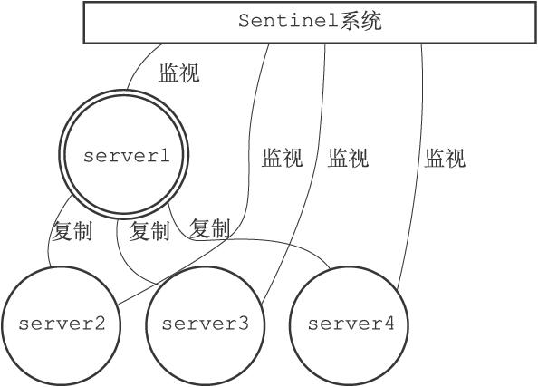

### 简介

Sentinel（哨兵）是Redis高可用性（HA）解决方案，由一个或者多个Sentinel实例组成的Sentinel系统，可以监视任意多个主服务器，以及这些主服务器属下的所有从服务器，并在被监视的主服务器进入下线状态时，自动将下线主服务器属下的某个从服务器升级为新的主服务器，然后由新的主服务器代替已下线的主服务器继续处理命令请求。

哨兵模式的选举机制见[Redis选举机制](./2021-05-29-Redis选举机制.md)

### Sentinel与Redis服务器之间的心跳

#### 与主服务器

Sentinel默认会以每十秒一次的频率，通过INFO命令获取主服务器的信息，可以获得以下这些信息

1.主服务器本身的信息，包括服务器id以及role域记录的服务器角色。

2.主服务器属下的所有从服务器信息，包括ip、端口等。

在获取到主服务器的信息后，Sentinel会将信息保存在实例中。

#### 与从服务器

当新从服务器出现时，Sentinel会创建链接到从服务器的命令连接和订阅连接。

同样是默认十秒一次的频率，通过命令连接向从服务器发送INFO命令，获取到以下信息

1.从服务器的id

2.从服务器的角色

3.主服务器的ip地址以及端口

4.主从服务器的连接状态

5.从服务器的优先级

6.从服务器的复制偏移量

### 检测下线状态

Redis中有两种下线状态，分别是主观下线和客观下线。

主观下线是指单个Sentinel实例发现某服务器在规定时间内返回了无效回复（通过down-after-milliseconds来设置阈值，需要注意，每个Sentinel配置的值可以不同），则这个Sentinel实例会修改它保存的服务器状态。

客观下线则是指某个Sentinel发现某服务器主观下线后，为了确认真的下线了，它会向监视了这一服务器的其他Sentinel进行询问，如果其他Sentinel也认为该服务器已下线，则会判定该服务器已客观下线，并对其执行故障转移操作。通过配置quorum参数，来决定判断客观下线需要的Sentinel实例数。

