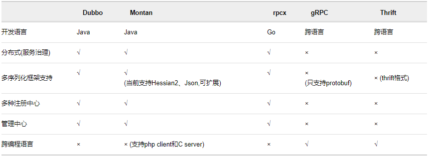

### gRPC详解

#### Rpc

RPC(remote procedure call 远程过程调用)框架实际是提供了一套机制，使得应用程序之间可以进行通信，而且也遵从server/client模型。使用的时候客户端调用server端提供的接口就像是调用本地的函数一样。


#### gRpc

gRpc是Rpc框架的一种，gRpc基于ProtoBuf协议，与其他Rpc框架对比如下。



#### gRPC的优点

1.因为基于protobuf进行序列化，而protobuf有很强的语义限制，因此在进行服务调用时，能够很好的限制调用入参。

2.基于protobuf进行序列化，gRPC的性能很强，因为protobuf是采用二进制传输，请求方和被请求方需要进行额外额外的编码和解码。

3.跨语言，gRPC有多种语言的版本，可以在不同语言之间进行调用。

#### gRPC的缺点

1.无法在实际业务中单独使用，只能作为业务中的一部分组件来使用，通常是需要将其作为一个组件。

2.与protobuf强绑定，而protobuf需要额外的文件来定义。


### 扩展

protobuf不仅仅是在gRPC中有使用，在netty中同样也有使用。

protobuf文件示例,protobuf可以使用protoc程序进行代码生成，类似于mybatis的逆向工程。

```
// [开始声明]
syntax = "proto3";
 //定义protobuf的包名称空间
package com.crazymakercircle.netty.protocol;
// [结束声明]

// [开始 java 选项配置]
option java_package = "com.crazymakercircle.netty.protocol";
option java_outer_classname = "MsgProtos";
// [结束 java 选项配置]

// [开始 消息定义]
message Msg {
  uint32 id = 1;  // Unique ID number for this person.
  string content = 2;
}

// [结束 消息定义]
```

