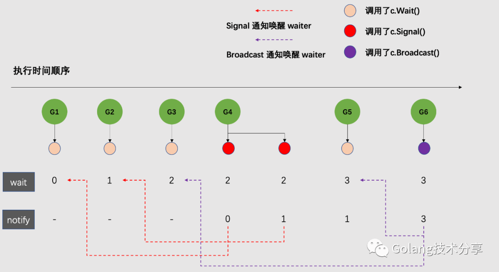

### 简介

同步条件变量，实现的是一个监控器模式。与java中的Condition的实现有点类似，都是通过实现一个队列，来将等待的goroutine存储起来，等待有goroutine调用signal或者broadcast。

```go
type Cond struct {
   // 复制检查
   noCopy noCopy

   // 锁
   // L is held while observing or changing the condition
   L Locker
   // 记录的是一个基于票号的通知列表
   notify  notifyList
   // 复制检查
   checker copyChecker
}
```


#### 核心方法

1.wait方法。

   将当前goroutine休眠，以等待被唤醒

```go
func (c *Cond) Wait() {
   c.checker.check()
   t := runtime_notifyListAdd(&c.notify)
   c.L.Unlock()
   runtime_notifyListWait(&c.notify, t)
   c.L.Lock()
}
```

在调用wait方法后，锁会被释放，因此可能会存在多个goroutine同时调用wait方法，导致调用wait方法的runtime_notifyListWait方法后，可能仍然不能满足当前goroutine 的继续条件，因此正确的wait使用姿势如下。

```go
 c.L.Lock()
 // 不断判断是否符合当前goroutine的运行条件
 for !condition() {
     c.Wait()
 }
 ... make use of condition ...
// unlock可以用defer
 c.L.Unlock()
```

2.signal方法

 唤起一个等待的goroutine,**不需要持有cond的锁即可唤起**

```go
// Signal wakes one goroutine waiting on c, if there is any.
//
// It is allowed but not required for the caller to hold c.L
// during the call.
func (c *Cond) Signal() {
   c.checker.check()
   runtime_notifyListNotifyOne(&c.notify)
}
```

3.broadcast方法

唤起所有等待的goroutine，**同样不需要持有cond的锁即可唤起。**

```go
// Broadcast wakes all goroutines waiting on c.
//
// It is allowed but not required for the caller to hold c.L
// during the call.
func (c *Cond) Broadcast() {
   c.checker.check()
   runtime_notifyListNotifyAll(&c.notify)
}
```

#### 拓展

可以看到，在cond的所有方法前，都有一个c.cheker.check(),这是为了保证当前cond没有被复制。

见另一篇

#### 原理解析

Cond 实现的核心模式为**票务系统（ticket system）**，每一个想要来买票的 goroutine （调用Cond.Wait()）我们称之为 waiter，票务系统会给每个 waiter 分配一个取票码，等供票方有该取票码的号时，就会唤醒 waiter。卖票的 goroutine 有两种，第一种是调用 Cond.Signal() 的，它会按照票号唤醒一个买票的 waiter （如果有的话），第二种是调用 Cond.Broadcast() 的，它会通知唤醒所有的阻塞 waiter。



#### 需要注意的一些地方

##### 饥饿问题

在cond的正确使用姿势中，因为需要循环判断是否符合条件，如果同时存在多个不同条件的goroutine，且存在条件差异过大的goroutine时，可能会导致某些goroutine一直处于等待中。例如，有若干个获取3个数的goroutine和一个获取3000个数的goroutine，每个goroutine解除等待的条件可能是某个chan或者数组中的数字达到指定数量，因此获取3000个数的goroutine可能会一直处于等待中，因为资源会被获取3个数的goroutine快速消耗。

```
 c.L.Lock()
 // 不断判断是否符合当前goroutine的运行条件
 for !condition() {
     c.Wait()
 }
 ... make use of condition ...
// unlock可以用defer
 c.L.Unlock()
```

##### 无法响应其他事件

因为调用wait方法以后，goroutine会整个处于停摆状态，当存在其他事件时，例如context取消，此时goroutine是无法响应的，可能会导致错失某些事件。

##### 替代性

因为chan的强大，cond可以被chan很好的替代。

#### 参考资料

[被遗弃在角落里的 sync.Cond (qq.com)](https://mp.weixin.qq.com/s?__biz=MzkyMzIyNjIxMQ==&mid=2247484671&idx=1&sn=0d197ec27200945accba5a21605a0d26&scene=19#wechat_redirect)