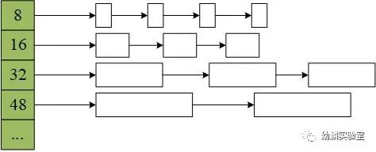

### 堆的基础存储单位

#### arena

go runtime会将堆划分为一个一个的arena，arena区域的起始地址被定义为常量arenaBaseOffset。

##### 大小

在amd64架构的linux环境下，arena的大小为64MB。

#### Page

page是比arena更小的单位，每个arena包含8192个page，每个page大小为8kb。

#### span

span是page的逻辑集合，同一个span只会存在一个arena中，一个span会包含多个page，并且按照特定规格划分为等大的内存块

### 管理堆内存的数据结构

#### heapArena

heapArena是在go的堆之外分配和管理的。heapArena存储着arena的元数据，里面有很多位图标记。其结构如下：

```
type heapArena struct {
  // 用于标记这个arena中，一个指针大小的内存单元到底是指针还是标量;
  // 再用一位来标记这块内存的后续单元是否包含指针
  // 位图的大小等于 arena的大小 / (指针的大小*8/2)
  // 这块不是很懂
  bitmap       [heapArenaBitmapBytes]byte
  // 是*mspan的数组，数组长度为arena中的page数量，用于定位page处于哪个span中。详见后面的mspan
  spans        [pagesPerArena]*mspan
  pageInUse    [pagesPerArena / 8]uint8
  pageMarks    [pagesPerArena / 8]uint8
  pageSpecials [pagesPerArena / 8]uint8
  checkmarks   *checkmarksMap
  zeroedBase   uintptr
}
```

#### mspan

mspan是用来管理span的数据结构。

### tcmalloc内存分配器算法

为了避免分散的、大小不一的碎片话内存和为了降低寻找大小合适的内存块因碎片话产生的额外开销，golang的内存分配算法采用的tcmalloc。

简单来说，就是按照一组预置的大小规格把内存也划分为块，然后把不同规格的内存块放入对应的空闲链表。



当程序申请内存时，分配器会先根据要申请的大小内存找到最匹配的规格，然后从对应链表中分配一个内存块。在go 1.16 runtime包中给出了67中预置大小的规格，最小8字节，最大32kb。


### 参考文档

[【Golang】堆内存管理（一） (qq.com)](https://mp.weixin.qq.com/s?__biz=Mzg5NjIwNzIxNQ==&mid=2247484861&idx=1&sn=2bda6d30e2d9da69ae8e73fd9a51b31f&chksm=c005d5bdf7725cab48ffa0d5d0745a013d9324ba888e99c5bb2231eb0efed517c56fe918e43b&cur_album_id=2139588961760083971&scene=189#wechat_redirect)