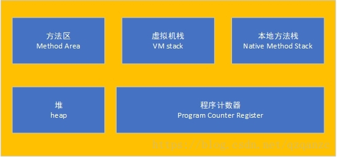

## jvm内存模型

### jvm内存分区

jvm内存分为堆、栈、程序计数器、堆外内存，其中堆可细分为新生代、老年代、方法区，栈可细分为程序方法栈、本地方法栈。

#### 堆

​	对于Java应用程序来说，Java堆（Java Heap）是虚拟机所管理的内存中最大的一块。Java堆是被**所有线程共享**的一块内存区域，在虚拟机启动时创建。此内存区域的唯一目的就是存放对象实例，Java世界里“几乎”所有的对象实例都在这里分配内存。堆细分为新生代、老年代、方法区。

##### 	新生代

###### 	区域划分

​	新生代区域划分为Eden区、survivor1和survivor2（survivor1和survivor2也叫from区和to区）。

######     新生代对象

​    非大对象会在创建时分配至Eden区，在下一次MinorGC时，将迁移至To区并年龄加一。

######     新生代年龄阈值

​    新生代中保存的对象，年龄均在一定范围内，有两种策略确定新生代年龄的阈值，要么通过配置jvm参数XXMaxTenuringThreshold来指定年龄，要么通过动态年龄判断来决定，动态年龄根据survivor区中各年龄对象占比决定，若minorGC结束后，在survivor区中的某个年龄的对象占比超过了survivor区的一半，那么这个年龄的对象同样也会进入老年代。

###### 新生代JVM参数

1. 设置新生代内存区域大小

| 参数           | 参数说明                                                     |
| -------------- | ------------------------------------------------------------ |
| -Xmn           | 设置新生代的初始大小和最大的大小，效果等同于将下面两个参数设置为同一个值。建议将新生代的内存大小设置为堆大小的3/8.以保证老年代内存大小不会过小。 |
| -XX:NewSize    | 设置新生代的初始大小（包括eden、from、to三个区）             |
| -XX:MaxNewSize | 设置新生代的最大大小（包括eden、from、to三个区）             |

2. 设置新生代中Eden区和survivor区的大小比例

​	-XX:SurvivorRatio，例如设置为8，则表示Eden：from：to = 8:1:1

3. 大对象

   -XX:PretenureSizeThreshold，设置大对象阈值，若对象的大小超过此阈值，直接进入老年代。

  4.新生代年龄

  -XXMaxTenuringThreshold，设置新生代年龄阈值，minorGC后，超过此年龄的对象将进入老年代。

######    垃圾回收算法

​	因为新生代的数据，通常是使用时间较短的，因此在进行minorGC时，为了保证内存的连续性，采用复制算法进行垃圾回收。

​    把Eden区和from区两个区中存活的对象，复制到to区中，然后将eden区和from区清空。

​    

#####   老年代

 当对象在新生代中存活时间超过阈值或者大小超过阈值则对象直接进入老年代中。

###### MajorGC

在老年代内存区域快满时，将触发MajorGC，即full GC，会对整个堆进行垃圾回收（可以通过参数设置，不对新生代进行GC）。

###### 垃圾回收算法

老年代中的对象存活时间通常都会很久，采用的算法为标记-清除算法。会先将需要清除的对象进行标记（根据收集器的不同，实现方式有所不同），然后将对象进行清除。

###### jvm参数

老年代大小设置

​	根据已找到的资料显示，老年代大小是根据堆大小减去新生代大小得到的，因此通过设置这两个参数，可以间接影响老年代大小。

​    堆大小设置：-Xms(初始堆大小)、-Xmx（最大堆大小）

老年代与新生代比例

​	-XX:NewRatio，例如设置为4，则表示老年代大小除以新生代大小等于4.

##### 方法区

方法区（Method Area）与Java堆一样，是各个线程共享的内存区域，它用于存储已被虚拟机加载的类型信息、常量、静态变量、即时编译器编译后的代码缓存等数据。

###### 方法区实现方式

在JDK8之前，实现方式为永久代，在JDK8之后，实现方式为元空间。

###### 运行时常量池

运行时常量池（Runtime Constant Pool）是方法区的一部分。Class文件中除了有类的版本、字段、方法、接口等描述信息外，还有一项信息是常量池表（Constant Pool Table），用于存放编译期生成的各种字面量与符号引用，这部分内容将在类加载后存放到方法区的运行时常量池中。

常量池作为方法区的一部分，当无法申请过到内存时，会报OOM异常。

##### 堆溢出

如果在Java堆中没有内存完成实例分配，并且堆也无法再 扩展时，Java虚拟机将会抛出OutOfMemoryError异常。

举例，往某个List中一直添加元素。

#### 栈

栈分为本地方法栈和程序方法栈，两者都不是线程共享的。

##### 程序方法栈

Java虚拟机栈（Java Virtual Machine Stack）是线程私有的，它的生命周期 与线程相同。虚拟机栈描述的是Java方法执行的线程内存模型：每个方法被执行的时候，Java虚拟机都 会同步创建一个栈帧（Stack Frame）用于存储局部变量表、操作数栈、动态连接、方法出口等信息。每一个方法被调用直至执行完毕的过程，就对应着一个栈帧在虚拟机栈中从入栈到出栈的过程。

###### 栈溢出

当栈无法申请到内存时，会报StackOverflowError异常。

举例，方法递归调用当前方法，且未设置合理的终止条件。

##### 本地方法栈

本地方法栈（Native Method Stacks）与虚拟机栈所发挥的作用是非常相似的，其区别只是虚拟机 栈为虚拟机执行Java方法（也就是字节码）服务，而本地方法栈则是为虚拟机使用到的本地（Native）方法服务。 同样会出现栈溢出的情况。

#### 程序计数器

程序计数器（Program Counter Register）是一块较小的内存空间，它可以看作是当前线程所执行的 字节码的行号指示器。在Java虚拟机的概念模型里[1]，字节码解释器工作时就是通过改变这个计数器的值来选取下一条需要执行的字节码指令，它是程序控制流的指示器，分支、循环、跳转、异常处理、线程恢复等基础功能都需要依赖这个计数器来完成。

#### 堆外内存

直接内存（Direct Memory）并不是虚拟机运行时数据区的一部分，也不是《Java虚拟机规范》中定义的内存区域。在JDK 1.4中新加入了NIO（New Input/Output）类，引入了一种基于通道（Channel）与缓冲区 （Buffer）的I/O方式，它可以使用Native函数库直接分配堆外内存，然后通过一个存储在Java堆里面的 DirectByteBuffer对象作为这块内存的引用进行操作。这样能在一些场景中显著提高性能，因为避免了在Java堆和Native堆中来回复制数据。

参考资料

《深入理解Java虚拟机：JVM高级特性与最佳实践（第3版）》 -- 周志明

