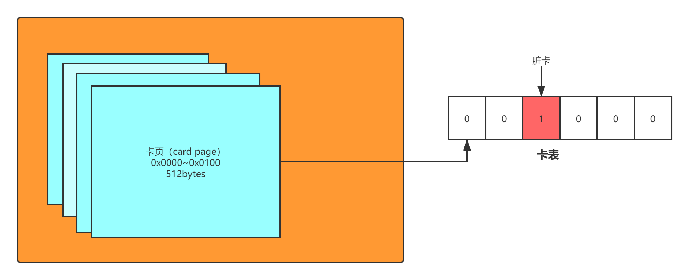

## 垃圾回收算法

### 可达性算法

如何标记一个对象是否可以进行回收？常见的有两种，引用计数法和可达性算法，引用计数法比较简单，通过给每个对象添加一个引用计数器，当出现引用时，将计数器加一即可，但是引用计数法无法处理循环依赖的问题，因此目前主流的垃圾回收收集器都是采用可达性算法来进行对象是否可回收的判定。

#### 算法思想

可达性算法的主要思想是，使用一些对象作为根节点（GC ROOT），从根节点一步步向下搜索，搜索的路径称为引用链，当某个对象不在任意一条引用链上时，则表示这个对象不可达，则会被标记为需要清除的对象。

#### GC ROOT

作为可达性算法的起点，GC ROOT至关重要，所以需要采用一些比较重要或者无法变动的对象作为节点。

GCROOT可以使用以下几种对象：

##### 1.虚拟机栈(栈帧中的本地变量表)中引用的对象

   当某个对象是在方法调用时出现的局部变量，且该方法仍然处于栈帧中，则其局部变量可以作为根节点，所有局部变量引用链上的对象都不会被标记。

   例如,如下代码中，存在method方法，method方法显示调用System.gc()，但是由于method方法仍然处于栈帧中，t变量不会被回收，将作为GC ROOT进行可达性标记。若method方法执行完成，后续有其他地方再次触发GC，则method方法因为已经不在栈帧当中，则t变量会被进行回收（因为是局部变量，已不可达）。

```java
public static void method() {
    Test t = new Test();
    System.gc();
    System.out.println("GC done");
}
```

##### 2.本地方法栈(Native 方法)中引用的对象

   同虚拟机栈中引用的对象一样，本地方法栈中引用的对象也可以作为GC ROOT。

##### 3.方法区中类静态属性引用的对象

   当某个对象为静态对象（被static修饰），则它不会被minorGC或fullGC所回收，它的最终归宿就在老年代中，因此这一类对象可以理解为永远不会消失的，可以作为GCROOT。

##### 4.方法区中类常量引用的对象

  当某个对象为常量（被static final修饰），则它本身就是不会变更的，会永远存在，同样也可以作为GCROOT。

##### 5.所有被同步锁持有的对象

  当某个代码块被同步锁给锁住，则该代码块中的所有对象，都应该是不能被回收的，因此代码块中的所有对象都可以作为GCROOT。

##### GC ROOT所涉及的内存区域

综合上面的五种GCROOT，在jvm内存区域中，会有以下几个区域与此相关。

1.虚拟机栈：虚拟机栈中用于存储线程的调用栈，栈帧中的本地变量表是决定是否对象可以作为GCROOT的依据。

2.本地方法栈：同虚拟机栈。

3.方法区：方法区中的运行时常量池中，会存在类常量，因此也会涉及。

4.堆：同步锁持有的对象可能在堆中。


### 标记-复制算法

标记算法将内存空间分为两个部分，from和to区两个部分。

当jvm运行时，只会使用其中一个部分，也就是from区，当from区满了以后，将from区中的对象进行可达性分析，标记需要清除的对象，标记完成后，将不需要清除的对象迁移至to区中，将from区清空，最后旧的to区作为新一轮的from区，旧的from区作为新的to区。

**优点：效率高，内存连续度高，不会出现内存碎片。**

**缺点：内存使用率不高，因为运行时，都只能使用一半的内存空间。**


### 标记-清除算法

标记清除算法非常简单粗暴，在内存空间满了以后，将内存中的对象进行可达性标记，标记完成以后，将所有不需要保留的对象全部清除。

**优点：最基础的算法，算法简单。**

**缺点：容易产生内存碎片，导致无法放入大对象。标记和清除的过程效率都不算高。**


### 标记-整理算法

因为前面两种算法仍然存在可优化空间，因此标记-整理算法出现了，标记-整理算法比较适用于老年代中，主要分为标记和整理两个步骤，在标记完成以后，将存活下来的对象迁移到同一侧，然后清除所有边界以外的对象，因此是不会产生内存碎片的。


### 分代收集思想

在jvm堆中，存在新生代和老年代，因为两代的特性不太一样，为了保证垃圾回收更加合理且高效，HotPot虚拟机大部分收集器都采用了分带收集的思想，在新生代中使用标记-复制算法，在老年代中使用标记-整理算法或者标记-清除算法。


### 一些算法实现细节

#### 根节点枚举

所有收集器在根节点枚举这一步骤时都是必须暂停用户线程的，因此毫无疑问根节点枚举与之前提及的整理内存碎片一样会面临相似的“Stop The World”的困扰。为了减少根节点枚举的时间，HotSpot采用的方案是使用一组称为OopMap的数据结构来存储根节点。jvm在将class文件编译时，会在必要的地方添加OopMap的指令，这里“必要的地方”指的是下面的安全点。


#### 安全点

为了减少OopMap指令的出现次数，降低OopMap需要的存储空间，出现了安全点的概念，在进行垃圾回收之前，要求所有线程均达到安全点才允许进行垃圾回收。因此，安全点的选定既不能太少以至于让收集器等待时间过长，也不能太过频繁以至于过分增大运行时的内存负荷。安全点位置的选取基本上是以“是否具有让程序长时间执行的特征”为标准进行选定的，因为每条指令执行的时间都非常短暂，程序不太可能因为指令流长度太长这样的原因而长时间执行，“长时间执行”的最明显特征就是指令序列的复用，例如方法调用、循环跳转、异常跳转等都属于指令序列复用，所以只有具有这些功能的指令才会产生安全点。

##### 安全点中断方式

为了保证在进行垃圾回收时，所有线程都到达了安全点，有两种方式进行线程中断，一种是抢救式中断，一种是主动式中断。

抢救式中断：在进行垃圾回收时，将所有用户线程都暂停，然后挨个检查每个用户线程是否在安全点上，如果发现某个线程不在安全点上，则恢复该线程，直到它到达安全点。

主动式中断：用户线程在执行时，通过不断轮询一个标志位，来判定是否能够继续执行，一旦发现标志位为真，则执行到下个安全点后挂起线程。HotSpot使用内存保护陷阱的方式，把轮询操作精简至只有一条汇编指令的程度。在编译后的指令中，会存在一个test指令，test指定会尝试读取0x160100位置上的内存页，如果发现不可读（表明需要进行用户线程的中断），则线程会抛出异常，异常会被预先设置好的处理器处理，处理器会将线程挂起。


#### 安全区域

使用安全点的设计似乎已经完美解决如何停顿用户线程，让虚拟机进入垃圾回收状态的问题了，但实际情况却并不一定。安全点机制保证了程序执行时，在不太长的时间内就会遇到可进入垃圾收集过程的安全点。但是，程序“不执行”的时候呢？所谓的程序不执行就是没有分配处理器时间，典型的 场景便是用户线程处Sleep状态或者Blocked状态，这时候线程无法响应虚拟机的中断请求，不能再走 到安全的地方去中断挂起自己，虚拟机也显然不可能持续等待线程重新被激活分配处理器时间。对于这种情况，就必须引入安全区域（Safe Region）来解决。 

安全区域是指能够确保在某一段代码片段之中，引用关系不会发生变化，因此，在这个区域中任意地方开始垃圾收集都是安全的。我们也可以把安全区域看作被扩展拉伸了的安全点。

当用户线程执行到安全区域里面的代码时，首先会标识自己已经进入了安全区域，那样当这段时 间里虚拟机要发起垃圾收集时就不必去管这些已声明自己在安全区域内的线程了。当线程要离开安全 区域时，它要检查虚拟机是否已经完成了根节点枚举（或者垃圾收集过程中其他需要暂停用户线程的 阶段），如果完成了，那线程就当作没事发生过，继续执行；否则它就必须一直等待，直到收到可以离开安全区域的信号为止。


#### 记忆集与卡表

在分代收集理论中，为了处理跨代引用的问题，垃圾收集器在新生代中建立了名为记忆集的数据结构，用于避免在进行GC时把整个老年代加进扫描范围。

没有使用分代收集理论的收集器，例如G1，ZGC等，为了解决跨区域收集的问题，同样也采用了记忆集的方式。

记忆集是一种用于记录从**非收集区域**指向**收集区域**的指针集合的抽象数据结构。

##### 记忆集的分类

根据记忆集记录的精度，可以将记忆集大致分为三种类型：

1.字长精度：每条记录精确到一个机器字长（根据操作系统位数可分为32位和64位），该字包含了跨代或跨区域指针。

2.对象精度：每条记录精确到一个对象，该对象会包含跨代或跨区域指针。

3.卡精度：每条记录精确到一个内存区域，该区域内含有跨代或跨区域指针。也被称为卡表。

字长精度最为精确，记忆集中的一条记录可以直接获取到存在跨代引用的指针，对象精度需要再遍历对象中的字段来判断是否存在跨代引用，卡精度是将内存区域划分为若干个区域，记录每个区域中存在跨代引用的对象。可以看出，在精度方面，字长精度最精确，卡精度最不精确，因此，为了维护记忆集所占用的内存也是字长精度最多，卡精度最少。

###### 卡表的实现

在虚拟机中，卡表是通过数组实现的，以下这行代 码是HotSpot默认的卡表标记逻辑： 

CARD_TABLE [this address >> 9] = 0;

字节数组CARD_TABLE的每一个元素都对应着其标识的内存区域中一块特定大小的内存块，这个内存块被称作“卡页”（Card Page）。一般来说，卡页大小都是以2的N次幂的字节数，通过上面代码可以看出HotSpot中使用的卡页是2的9次幂，即512字节（地址右移9位，相当于用地址除以512）。那如果卡表标识内存区域的起始地址是0x0000的话，数组CARD_TABLE的第0、1、2号元素，分别对应了地址范围为0x0000～0x01FF、0x0200～0x03FF、0x0400～0x05FF的卡页内存块，如图所示。 


 一个卡页的内存中通常包含不止一个对象，只要卡页内有一个（或更多）对象的字段存在着跨代 指针，那就将对应卡表的数组元素的值标识为1，即CARD_TABLE[this address >> 9 ] = 1，称为这个元素变脏（Dirty），没有则标识为0。在垃 圾收集发生时，只要筛选出卡表中变脏的元素，就能轻易得出哪些卡页内存块中包含跨代指针，把它们加入GC Roots中一并扫描。 


#### 写屏障

写屏障是为了维护卡表状态实现的技术，实现手段是aop，类似于Spring中的Aop实现，在进行引用更新前后，添加对应的指令，在引用更新前的为写前屏障，在引用更新后的为写后屏障，大部分收集器都是使用的写后屏障，G1出现后，才开始使用写前屏障。

```c++
void oop_field_store(oop* field, oop new_value) {
// 引用字段赋值操作
*field = new_value;
// 写后屏障，在这里完成卡表状态更新
post_write_barrier(field, new_value);
}
```

使用写屏障会增加系统的开销，但是这个开销相对于GC时扫描整个老年代的开销来说，已经低了很多了。

#### 伪共享

现代中央处理器中的缓存系统都是通过缓存行（CacheLine）来实现的，当多线程同时修改相互独立的变量时，如果修改的变量属于同一个缓存行，那么就会互相影响（写回、无效化或者同步），进而导致性能降低。

假设处理器的缓存行大小为64字节，由于一个卡表元素占1个字节，64个卡表元素将共享同一个缓存行。这64个卡表元素对应的卡页总的内存为32KB（64×512字节），也就是说如果不同线程更新的对象正好处于这32KB的内存区域内，就会导致更新卡表时正好写入同一个缓存行而影响性能。为了避免伪共享问题，一种简单的解决方案是不采用无条件的写屏障，而是先检查卡表标记，只有当该卡表元素未被标记过时才将其标记为变脏，即将卡表更新的逻辑变为以下代码所示：

```c++
if (CARD_TABLE [this address >> 9] != 0)
    CARD_TABLE [this address >> 9] = 0;
```


在JDK 7之后，HotSpot虚拟机增加了一个新的参数-XX：+UseCondCardMark，用来决定是否开启卡表更新的条件判断。开启会增加一次额外判断的开销，但能够避免伪共享问题，两者各有性能损耗，是否打开要根据应用实际运行情况来进行测试权衡。

#### 并发可达性分析

当代垃圾收集器基本上都是基于可达性分析进行对象标记的，可达性算法理论上都要依据一个能保证一致性的快照来实现，这意味着进行过程需要暂停用户线程，可达性分析主要分为两步，第一步是GCROOT的获取，得益于OopMap，GCROOT的获取相对固定且高效，第二步，基于GCROOT向下遍历对象图，这一步的效率取决于堆中对象的个数。

##### 为什么一定要在能够保证一致性的快照基础上进行遍历？

如果可达性分析不是在一致性快照的基础上实现的，那么在进行对象遍历的时候，有可能用户线程对对象进行了修改，导致已经被分析过的对象产生了改变，从而导致本不该被回收的对象被回收了或者被应该被回收的对象没有被回收，如果是后者，只是让对象多活过了一轮，下次GC仍然可以被回收，但如果是前者，那么就容易导致用户线程出现问题。

三色理论：将对象分为三种类型，分别用黑色、灰色、白色来标记。

​	黑色表示此对象已经被扫描过，且该对象所有的引用也扫描完成。

​	灰色表示此对象已经被扫描过，但该对象的引用未扫描完成。

​	白色表示此对象没有被扫描过。

当进行可达性分析时，满足以下两个条件，则会导致本来应该被标记为黑色的对象被错误的标记为白色。

**1.赋值器插入了一条或多条从黑色对象到白色对象的新引用。**
**2.赋值器删除了全部从灰色对象到该白色对象的直接或间接引用。**

因为必须两个条件都满足，因为破坏其中一个条件即可避免，主流的方案有两个，分别是**增量更新**和**原始快照**。

增量更新要破坏的是第一个条件，当黑色对象插入新的指向白色对象的引用关系时，就将这个新插入的引用记录下来，等并发扫描结束之后，再将这些记录过的引用关系中的黑色对象为根，重新扫描一次。这可以简化理解为，黑色对象一旦新插入了指向白色对象的引用之后，它就变回灰色对象了。

原始快照要破坏的是第二个条件，当灰色对象要删除指向白色对象的引用关系时，就将这个要删除的引用记录下来，在并发扫描结束之后，再将这些记录过的引用关系中的灰色对象为根，重新扫描一次。这也可以简化理解为，无论引用关系删除与否，都会按照刚刚开始扫描那一刻的对象图快照来进行搜索。


### 参考资料

https://blog.csdn.net/u010798968/article/details/72835255

https://github.com/Snailclimb/JavaGuide/blob/master/docs/java/jvm/JVM%E5%9E%83%E5%9C%BE%E5%9B%9E%E6%94%B6.md

《深入理解Java虚拟机》
