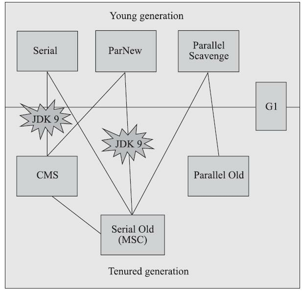
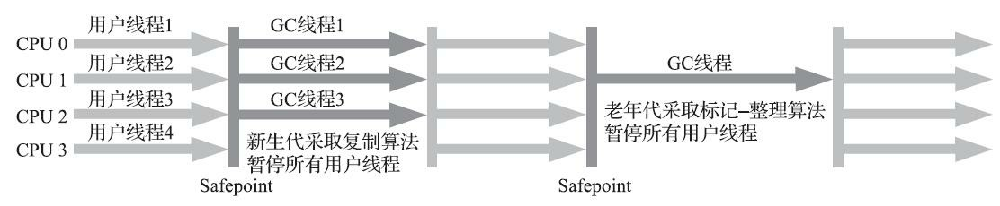

## 垃圾收集器

如果说收集算法是内存回收的方法论，那垃圾收集器就是内存回收的实践者。

下面是常用垃圾收集器的组合图，连线表示可以混合使用。

根据垃圾回收器的出现时间，可以分为经典垃圾收集器和低延迟垃圾收集器两大类，经典垃圾收集器以CMS、G1为核心代表，低延迟垃圾收集器以ZGC为核心代表。

### 相关术语解释

STW - stop the world,垃圾收集器在进行收集时，需要停顿用户线程，这种现象称为stop the world，简称STW。

吞吐量 - 是用户代码运行时间除以用户代码运行时间加上垃圾收集时间得出的比值。

### 经典垃圾收集器

经典垃圾回收器是指在JDK7之后、JDK11之前的这一类垃圾回收器。

#### 新生代收集器

新生代收集器主要有Serial、ParNew、Parallel Scavenge三种。

##### Serial收集器

Serial是最经典的垃圾收集器，它的特点很鲜明，就是在进行垃圾收集时，必须暂停所有的用户线程，直到收集器工作完成。

Serial收集器的工作流程如下图所示（老年代使用Serial Old），在进行垃圾收集时，可以看到用户线程全部停止,使用标记-复制算法进行垃圾收集。

优点：简单、高效，内存占用很小，对于单核或者核心数量较少的处理器，没有线程交互的开销。

缺点：STW（stop the world）时间长，若堆内需要回收的对象很多，GC线程会占用很长时间。

在当前微服务的趋势下，单个系统的内存如果不大，Serial收集器其实不失为一个很好的选择，因为在内存小的情况下，STW的时间并不会太长。

##### ParNew收集器

是Serial的多线程版本，同样在垃圾收集期间需要暂停所有用户线程，使用多线程进行垃圾收集，相关参数与Serial基本共用，在实现逻辑上也是与Serial相同的。

ParNew与Serial Old结合使用的示意图如下，ParNew在新生代中使用标记-复制算法。

在JDK9之前，得益于其是能够与CMS收集器一起使用的唯一一种收集器，因此，在JDK9之前是比较主流的新生代收集器。

ParNew收集器在单核心处理器的环境中绝对不会有比Serial收集器更好的效果，甚至由于存在线程交互的开销，该收集器在通过超线程（Hyper-Threading）技术实现的伪双核处理器环境中都不能百分之百保证超越Serial收集器。当然，随着可以被使用的处理器核心数量的增加，ParNew对于垃圾收集时系统资源的高效利用还是很有好处的。它默认开启的收集线程数与处理器核心数量相同，在处理器核心非常多（譬如32个，现在CPU都是多核加超线程设计，服务器达到或超过32个逻辑核心的情况非常普遍）的环境中，可以使用-XX：ParallelGCThreads参数来限制垃圾收集的线程数。

##### Parallel Scavenge收集器

Parallel Scavenge收集器在收集方式上与ParNew如出一辙，但是相比于ParNew、CMS这种以减少STW时间的收集器不同，Parallel Scavenge收集器的目标是提高吞吐量。

Parallel Scavenge收集器提供了两个参数用于精确控制吞吐量，分别是控制最大垃圾收集停顿时间的-XX：MaxGCPauseMillis参数以及直接设置吞吐量大小的-XX：GCTimeRatio参数。

-XX：MaxGCPauseMillis - 设置垃圾收集所允许的停顿时间，如果设置的过小，虽然单次收集的停顿时间变短，但是GC的次数会增加，导致吞吐量实际上会下降。

-XX：GCTimeRatio - 垃圾收集时间占总时间的比例，与吞吐量成反比，GCTimeRatio值越大，表示垃圾收集的时间占比越大，则吞吐量下降。可选值为0-100.

-XX：+UseAdaptiveSizePolicy - 自动调整策略，设置开启此策略以后，新生代大小、Eden区大小、survivor区大小、新生代年龄等参数均会自动按照当前系统的运行信息进行自动调整，虚拟机会根据上面的XX：MaxGCPauseMillis 和XX：GCTimeRatio参数所设置的目标，尽可能的优化当前虚拟机的运行。

##### 

#### 老年代收集器

##### Serial Old收集器

Serial收集器的老年代版本，使用单线程进行垃圾收集，在垃圾收集期间，需要暂停所有的用户线程。

其收集方式与Serial收集器一致，使用标记-整理算法进行垃圾收集。

Serial Old通常与Parallel Scavenge收集器一起使用，Serial Old有个特殊的地方在于，它会作为CMS的备选，当CMS出现并发失败时（详见后面的CMS收集器），虚拟机会采用Serial Old进行替换使用。

##### Parallel Old收集器

Parallel Scavenge收集器的老年代版本，同样以提高系统吞吐量为目标，基于标记-整理算法实现。

Parallel Old只能与Parallel Scavenge搭配使用。

##### CMS收集器

CMS全程为Concurrent Mark Sweep，使用的算法是标记-清除算法，通过并发标记，尽可能减少用户停顿时间。

CMS收集的流程主要分为四步：

1.初始标记 - 标记一下GCROOT能够直接关联的对象，会STW，但是因为标记的对象不多，所以暂停的时间很短。

2.并发标记 - 遍历整个对象图，可以与用户线程并行，不会造成STW。

3.重新标记 - 处理并发标记过程中，用户线程修改引用的对象，使用增量更新的手段处理并发可达性分析。这个阶段会暂停用户线程，但是时间会比并发标记短很多。

4.并发清除 - 将已经死掉的对象进行清除，因为使用的是标记-清除算法，所以在清除过程中不会对用户线程造成影响，因此可以和用户线程并行。

// TODO 添加图片

优点：作为并发收集器，它的最大优点是大部分时间可以和用户线程并行，停顿时间短。

**缺点**：1.对系统处理器资源敏感，因为会和用户线程并行，导致在并发标记或者并发清除时，会占用系统处理器资源，变相的导致了吞吐量的降低，CMS默认启动的回收线程数是（处理器核心数量+3）/4，也就是说，如果处理器核心数在四个或以上，并发回收时垃圾收集线程只占用不超过25%的处理器运算资源，并且会随着处理器核心数量的增加而下降。但是当处理器核心数量不足四个时，CMS对用户程序的影响就可能变得很大，因为此时回收线程的数量占比会很大。

​	   2.无法处理“浮动垃圾”，在进行并发标记和并发清除过程中，为了保证用户线程的正常运行，需要预留内存空间给用户线程使用，因此，与其他收集器在老年代满的时候才进行GC不同，CMS在老年代的内存达到一定阈值就会开始垃圾收集，这也导致了一个问题，预留多少内存才合适，如果在进行垃圾收集的过程中，预留的内存无法满足新对象的分配，则会触发“并发失败”,虚拟机会使用Serial Old来作为备选方案进行垃圾收集，可以通过-XX：CMSInitiatingOccupancyFraction参数来设置启动垃圾收集的阈值，它是一个百分比的值。

​	   3.内存碎片问题，因为使用的是标记-清除算法，导致在垃圾收集结束以后，出现很多内存碎片，无法处理一些比较大的对象，此时很有可能明明还有足够的内存，但只能通过触发GC来再次清理。

#### G1收集器

不同于上述其他收集器，G1收集器不是针对于具体某个代的，而是针对于整个堆的，将堆分成若干个Region，可以针对局部进行垃圾收集。

在G1出现之前，所有的收集器要么针对新生代进行收集（minorGC），要么针对老年代进行收集（MajorGC），要么对整个堆进行收集（Full GC），G1是以Region为单位进行收集，需要进行收集的Region会组成回收集（Collection Set，简称CSet），衡量Region是否需要收集的标准不再是其是否属于某个代，而是哪个Region中的垃圾数量最多，回收的收益最大，此类GC模式也称为MixedGC。

##### G1收集器下的内存布局

在使用G1收集器时，虚拟机会将内存分为若干个Region区域，每个Region都可以根据需要扮演新生代Eden、新生代Survivor、老年代，在进行垃圾收集时，可以根据Region扮演角色的不同，使用不同的策略进行收集。

当出现超过单个Region大小一半的大对象时，会将大对象分配到一类称为Humongous的Region区域中，若对象超过单个Region大小，还可以通过组合N个连续的Humongous区域来进行存储。

G1为每一个Region设计了两个名为TAMS（Top at Mark Start）的指针，把Region中的一部分空间划分出来用于并发回收过程中的新对象分配，并发回收时新分配的对象地址都必须要在这两个指针位置以上。

##### G1收集优先级

为了达到用户所设置的停顿时间（使用参数-XX：MaxGCPauseMillis指定，默认值是200毫秒），G1在收集时，会优先考虑回收价值大的Region，评估回收价值是通过判断Region中脏卡表的数量、Region回收耗时等条件来进行评估。

##### G1收集步骤

主要分为四个步骤：

1.初始标记 - 标记GCROOT能够直接关联到的对象，并修改TAMS（Top at Mark Start）指针的值，这个阶段需要暂停用户线程，G1借用MinorGC进行初始标记，因此不需要额外的停顿时间。

2.并发标记 - 遍历整个对象图，标记需要收集的对象，基于原始快照的方式解决并发标记的问题。（详见并发可达性分析），同样有可能造成并发失败，进而退化成Serial Old或者Serial。

3.最终标记 - 处理在并发标记阶段，用户线程所遗留的对象。

4.筛选回收 - 更新每个Region的统计数据，按照Region回收价值和回收成本进行排序，根据用户制定的停顿时间来制定回收计划，可以选择若干个Region组成回收集，将需要保留的对象迁移至新的空Region，然后清除掉原来的Region。这个阶段涉及对象的移动，因此会暂停用户线程。

##### 跨代引用问题

G1采用的解决方式是卡表，每个Region会维护一个自己的卡表，记录着所有指向当前Region的对象的指针，并标记这些指针指向的对象在哪些卡页中。

因为每个Region都有维护自己的卡表，这导致G1在内存占用上会比其他收集器更高，大概需要整个堆内存的10%-20%左右的空间来维持收集器的工作。

##### 与CMS的对比

G1与CMS对比有以下特点：

1.G1采用的是标记-整理、标记-复制算法，相较于CMS的标记-清除，不容易产生内存碎片。

2.G1采用分Region的垃圾收集，单次收集收益更大。

3.G1可以指定最大停顿时间。

4.G1占用的系统内存比CMS大很多。

5.G1使用原始快照的方式进行并发标记，同时因为每个Region都维护了卡表，G1需要在写前屏障中跟踪并发指针的变化，在写后屏障中，和CMS一样，也需要更新卡表。相较于CMS来说，G1的操作会更多且更复杂，因此G1在进行处理时，采用的是类似于消息队列的方式来进行异步处理。

#### ZGC

//TODO

### 参考资料

《深入理解Java虚拟机》

