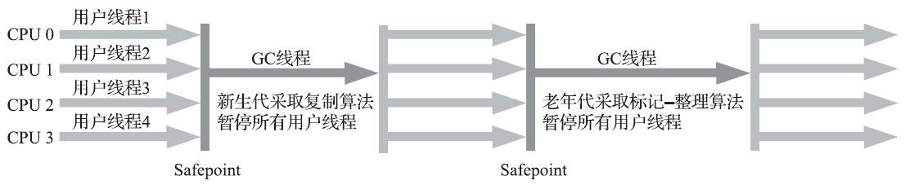

## 垃圾收集器

如果说收集算法是内存回收的方法论，那垃圾收集器就是内存回收的实践者。

下面是常用垃圾收集器的组合图，连线表示可以混合使用。

根据垃圾回收器的出现时间，可以分为经典垃圾收集器和低延迟垃圾收集器两大类，经典垃圾收集器以CMS为核心代表，低延迟垃圾收集器以G1为核心代表。

### 相关术语解释

STW - stop the world,垃圾收集器在进行收集时，需要停顿用户线程，这种现象称为stop the world，简称STW。

吞吐量 - 是用户代码运行时间除以用户代码运行时间加上垃圾收集时间得出的比值。

### 经典垃圾收集器

经典垃圾回收器是指在JDK7之后、JDK11之前的这一类垃圾回收器。

#### 新生代收集器

新生代收集器主要有Serial、ParNew、Parallel Scavenge三种。

##### Serial收集器

Serial是最经典的垃圾收集器，它的特点很鲜明，就是在进行垃圾收集时，必须暂停所有的用户线程，直到收集器工作完成。

Serial收集器的工作流程如下图所示（老年代使用Serial Old），在进行垃圾收集时，可以看到用户线程全部停止,使用标记-复制算法进行垃圾收集。

优点：简单、高效，内存占用很小，对于单核或者核心数量较少的处理器，没有线程交互的开销。

缺点：STW（stop the world）时间长，若堆内需要回收的对象很多，GC线程会占用很长时间。

在当前微服务的趋势下，单个系统的内存如果不大，Serial收集器其实不失为一个很好的选择，因为在内存小的情况下，STW的时间并不会太长。

##### ParNew收集器

是Serial的多线程版本，同样在垃圾收集期间需要暂停所有用户线程，使用多线程进行垃圾收集，相关参数与Serial基本共用，在实现逻辑上也是与Serial相同的。

ParNew与Serial Old结合使用的示意图如下，ParNew在新生代中使用标记-复制算法。

在JDK9之前，得益于其是能够与CMS收集器一起使用的唯一一种收集器，因此，在JDK9之前是比较主流的新生代收集器。

ParNew收集器在单核心处理器的环境中绝对不会有比Serial收集器更好的效果，甚至由于存在线程交互的开销，该收集器在通过超线程（Hyper-Threading）技术实现的伪双核处理器环境中都不能百分之百保证超越Serial收集器。当然，随着可以被使用的处理器核心数量的增加，ParNew对于垃圾收集时系统资源的高效利用还是很有好处的。它默认开启的收集线程数与处理器核心数量相同，在处理器核心非常多（譬如32个，现在CPU都是多核加超线程设计，服务器达到或超过32个逻辑核心的情况非常普遍）的环境中，可以使用-XX：ParallelGCThreads参数来限制垃圾收集的线程数。

##### Parallel Scavenge收集器

Parallel Scavenge收集器在收集方式上与ParNew如出一辙，但是相比于ParNew、CMS这种以减少STW时间的收集器不同，Parallel Scavenge收集器的目标是提高吞吐量。

Parallel Scavenge收集器提供了两个参数用于精确控制吞吐量，分别是控制最大垃圾收集停顿时间的-XX：MaxGCPauseMillis参数以及直接设置吞吐量大小的-XX：GCTimeRatio参数。

-XX：MaxGCPauseMillis - 设置垃圾收集所允许的停顿时间，如果设置的过小，虽然单次收集的停顿时间变短，但是GC的次数会增加，导致吞吐量实际上会下降。

-XX：GCTimeRatio - 垃圾收集时间占总时间的比例，与吞吐量成反比，GCTimeRatio值越大，表示垃圾收集的时间占比越大，则吞吐量下降。可选值为0-100.

-XX：+UseAdaptiveSizePolicy - 自动调整策略，设置开启此策略以后，新生代大小、Eden区大小、survivor区大小、新生代年龄等参数均会自动按照当前系统的运行信息进行自动调整，虚拟机会根据上面的XX：MaxGCPauseMillis 和XX：GCTimeRatio参数所设置的目标，尽可能的优化当前虚拟机的运行。

##### 

#### 老年代收集器

##### Serial Old收集器

Serial收集器的老年代版本，使用单线程进行垃圾收集，在垃圾收集期间，需要暂停所有的用户线程。

其收集方式与Serial收集器一致，使用标记-整理算法进行垃圾收集。

Serial Old通常与Parallel Scavenge收集器一起使用，Serial Old有个特殊的地方在于，它会作为CMS的备选，当CMS出现并发模式异常时（详见后面的CMS收集器），虚拟机会采用Serial Old进行替换使用。

##### Parallel Old收集器

Parallel Scavenge收集器的老年代版本，同样以提高系统吞吐量为目标，基于标记-整理算法实现。

Parallel Old只能与Parallel Scavenge搭配使用。

##### CMS收集器

CMS全程为Concurrent Mark Sweep，使用的算法是标记-清除算法，通过并发标记，尽可能减少用户停顿时间。

