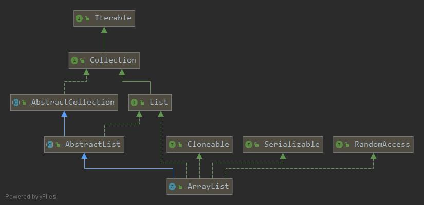

## 容器类

容器类大致分为两类，Collection和Map。

### Collection

Collection是容器的根接口，定义了一系列容器的基本功能，包括add、addAll、contains、isEmpty、remove、toArray、iterator等。

#### AbstractCollection

Collection的子类，提供了Collection接口部分方法的默认实现类，包括contains、remove、addAll、toArray等，这些方法都是通过先获取iterator然后循环去判断来实现的，因此在效率上并不会太高，子类有可能会重写，例如ArrayList重写了remove方法。

#### List

List是Collection的子接口，继承Collection后，List接口添加了一些方法，例如get、set、sublist等List专有的方法。

#### AbstractList

实现了AbstractCollection和List的抽象类，是ArrayList的父类，将List接口的一部分方法提供了默认实现，例如add方法、index方法、iterator方法。

##### ArrayList

ArrayList的类关系图如下



可以看出，ArrayList继承自AbstractList,同时实现了List、Cloneable、RandomAccess、Seraialzable等接口。

###### add方法解析

add作为主要添加元素的方法，使用频率很高。

add方法的主要逻辑如下：

```java
public boolean add(E e) {
    /*
    	检查当前数组大小能否放入新元素
    	1.先通过calculateCapacity方法判断当前数组是否为默认空数组，如果是的话，则将新数组大小设置为默认值与传入的数组大小的较大值。
    	2.计算出新数组的大小以后，通过ensureExplicitCapacity判断是否需要扩容，如果需要扩容，则使用Arrays.copy方法，将集合中的数组赋值为新生成的数组。
    	3.新数组的大小会先根据原数组大小的1.5倍，如果原数组的1.5倍大于设定的新数组大小，则新数组大小为原数组大小的1.5，同时会再和Integer.MaxValue-8进行对比，限制最大为Integer.MaxValue。
    */
    ensureCapacityInternal(size + 1);  
    // 将数组对应位置的元素替换为e。
    elementData[size++] = e;
    // 返回值标识是否插入成功
    return true;
}


```

###### addAll方法解析

addAll本质上是循环调用了add方法，方法实现在AbstractCollection中。

```java
public boolean addAll(Collection<? extends E> c) {
    boolean modified = false;
    for (E e : c)
        // 循环调用add方法
        if (add(e))
            // 只要存在一个添加成功的元素，则表示添加成功
            modified = true;
    return modified;
}
```

###### remove方法解析

remove的作用是去除集合中的元素，它存在两个重载的方法，一个是根据索引来删除，一个是根据元素来删除。

```java
public E remove(int index) {
    // 先检查index是否合规，检查方式是判断index是否小于size
    rangeCheck(index);
	// modCount集合被结构化修改的次数
    modCount++;
    // 通过数组定位到旧值
    E oldValue = elementData(index);
	// 计算需要移动的元素的数量
    int numMoved = size - index - 1;
    if (numMoved > 0)
        // 通过copy方法，把索引大于index的元素全部往前挪
        /*
        	假设现在ArrayList中有10个元素，分别是0到9
        	现在要移除第4个元素，也就是索引为3的元素，那么size - index - 1 = 10 - 3 - 1 = 6,则numMoved = 6
        	则arrayCopy会从第5个元素开始，复制numMoved，也就是6个元素，放置到elementData的第3个元素开始的6个位置上。
        	[0,1,2,3,4,5,6,7,8,9]     size = 10 , numMoved = 6
        	       ↑
        	     index
            [0,1,2,3,4,5,6,7,8,9]     从index+1索引开始的numMoved个元素为[4,5,6,7,8,9]
                     ↑
                  index+1   
           [0,1,2,3,4,5,6,7,8,9]      
           ↓↓↓↓↓↓↓↓↓↓↓↓↓↓↓↓↓↓↓↓↓
           [0,1,2,4,5,6,7,8,9,9]
           ↓↓↓↓↓↓↓↓↓↓↓↓↓↓↓↓↓↓↓↓↓
           [0,1,2,4,5,6,7,8,9,null]
        	     
        */
        System.arraycopy(elementData, index+1, elementData, index,
                         numMoved);
    // 将最后一个位置的元素置为空
    elementData[--size] = null; // clear to let GC do its work
	// 返回被移除的元素
    return oldValue;
}

public boolean remove(Object o) {
    if (o == null) {
        for (int index = 0; index < size; index++)
            // 判断数组中的元素是否等于o，如果是，则调用删除方法，删除方法整体逻辑与remove(index)类似，都是通过找到对应的索引，然后使用copy方法进行替换。
            if (elementData[index] == null) {
                fastRemove(index);
                return true;
            }
    } else {
        for (int index = 0; index < size; index++)
            if (o.equals(elementData[index])) {
                fastRemove(index);
                return true;
            }
    }
    return false;
}
```


##### LinkedList

##### Vector

##### Collections工具类使用

### Map

##### HashMap

##### ConcurrentHashMap

### Guava工具类
