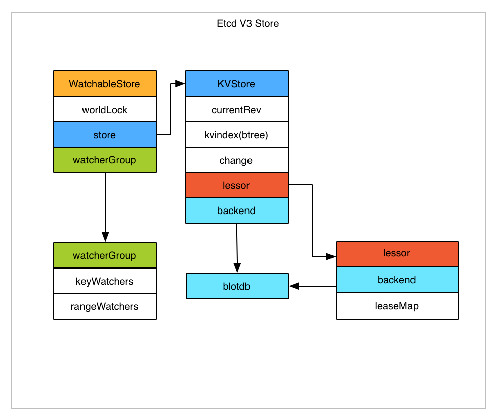

#### 简介

etcd在k8s中用于保存集群所有的网络配置和对象的状态信息。

#### ETCD提供的能力

1.提供存储以及获取数据的接口，它通过协议保证ETCD集群中的多个节点数据的强一致性。用于存储元数据以及共享配置。

2.提供监听机制，客户端可以监听某个key或者某些key的变更，用于监听和推送变更。

3.提供key的过期及续约机制，客户端通过定时刷新来实现续约。用于集群监控以及服务注册实现。

4.提供原子的CAS和CAD支持，用于分布式锁及leader。

#### ETCD如何实现一致性

[Raft协议](../一致性协议/2021-05-19-Raft协议.md)

#### 存储、Watch、过期机制

2.0和3.0的机制有所不同

// TODO 可以稍微看下etcd代码，这一块稍微有点复杂，暂时把博客里面的东西抄过来

##### 存储

2.0的存储是将数据完整的存储在内存中，通过node保存

##### watch

在watchhub中存储对应的key和watch列表，同时存在一个eventHistory存储已经发生的event。

##### 过期机制

node中保存过期时间，通过定时扫描去判断是否过期。

2.0 存储图

3.0

将存储和监听分开

##### 存储

内存中只保存kvindex(关联真正的存储的索引),真正的存储是对应的backend存储(例如boltdb)。

在boltdb中，etcd存储的key是reversion，value是key-value组合，也就是说，etcd会在boltdb中把每个版本都存储下来。

kvindex可以视作reversion和key之间的映射关系，用来加速查询。

##### watch

支持watch单个固定的key，也支持watch一个范围。

##### 过期机制

过期绑定在lease中，可以使用key和lease关联，实现多个key绑定同一个lease，进而可以统一设置过期时间，实现批量续约。

