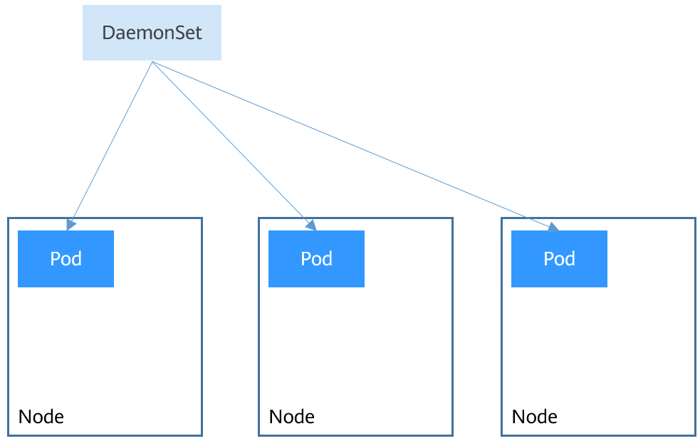

### 分类

控制器主要有Deployment、StatefulSet、DaemonSet、ReplicationController、Job、CronJob等。

### Deployment

用于管理Pod。

#### 主要应用场景

1. 创建Pod和ReplicaSet
2. 滚动升级和回滚应用
3. 扩容或者缩容
4. 暂停和继续

#### yaml文件示例

```
apiVersion: extensions/v1beta1
kind: Deployment
metadata:
  name: nginx-deployment
spec:
  replicas: 3
  template:
    metadata:
      labels:
        app: nginx
    spec:
      containers:
      - name: nginx
        image: nginx:1.7.9
        ports:
        - containerPort: 80
```

#### 结构示意图


#### 与Service、Pod之间的对应关系

一个Service可以有多个Deployment,一个Deployment可以对应多个Pod。

灰度发布实践：一个service创建3个Deployement(分别对应abc三个版本，且每个都设置为滚动升级)，每个Deployement创建2个Pod，发布a版本的Deployement，然后灰度验证（可以通过网关灰度、IP灰度，Istio灰度等），灰度完成之后，发布b版本，再次进行灰度验证，重复操作知道发布完成。

#### 参考文档地址

[Deployment · Kubernetes 中文指南——云原生应用架构实战手册 (jimmysong.io)](https://jimmysong.io/kubernetes-handbook/concepts/deployment.html)

### StatefulSet

带状态的集合，同样也是用于发布Pod，但与Deployement的区别之初在于，需要发布的Pod是有状态的，例如需要发布mysql，mysql如果两次发布没有部署到同一个Pod，其对应的volume可能就不同了，那么数据就发生了变化，将导致异常。此时就需要使用StatefulSet来控制有状态Pod的发布。

#### 与HeadlessService联动

为了访问一个StatefulSet，需要使用一个HeadlessService进行通讯。

#### 网络标识

StatefulSet创建以后，可以看下Pod是有固定名称的。每个Pod都有以下格式的域名：**`<pod-name>`.`<svc-name>`.`<namespace>`.svc.cluster.local**

#### 存储状态

statefulSet可以通过PVC做持久化存储，保证Pod重新调度后还是能访问到相同的持久化数据，在删除Pod时，PVC不会删除。

### DaemonSet

#### 简介

DaemonSet是一种守护进程，它在集群的每个节点上运行一个Pod，且保证只有一个Pod，非常适合于一些系统层面的应用，例如日志收集，资源监控等，这列应用需要再每个节点运行，且不需要太多实例。Kube-proxy就是典型的例子。

DaemonSet和节点相关，如果节点异常，也不会在其他节点重新创建。



#### 如何指定Node创建对应的daemon 容器

在DaemonSet的创建中，可以通过NodeSelector选择指定的Node，那么在对应的Node中，就会创建对应的Pod。


### Job和CronJob

Job和CronJob是负责批量处理短暂的一次性任务，即仅执行一次的任务，它保证批处理的一个或者多个Pod成功结束。

#### 两者不同

两者虽然都可以用来执行一次性任务，但是区别在于Job只执行一次，CronJob是基于时间的Job，在执行的时间周期内运行Job。

#### Job类型

1。一次性Job ，创建一个Pod直到成功结束

2。固定次数的Job，依次创建一个Pod运行直至completions（job 的yaml中配置的，默认是1）个成功结束.

3.固定结束次数的并行Job，依次创建多个Pod运行直至Completions个成功结束。

4。并行Job。创建一个或者多个Pod直至有一个成功结束。
