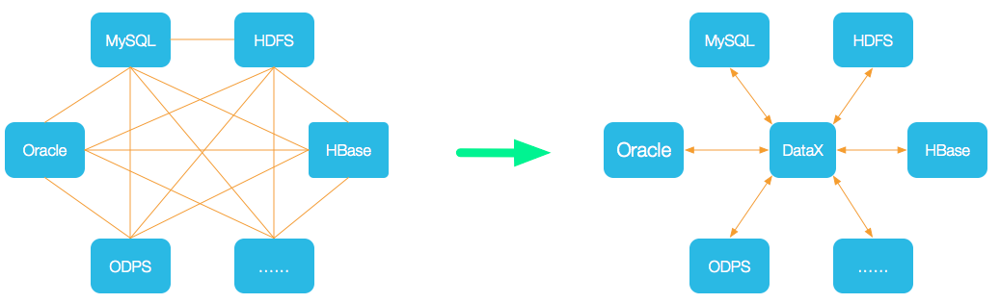
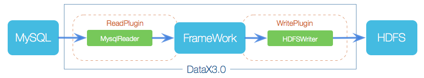
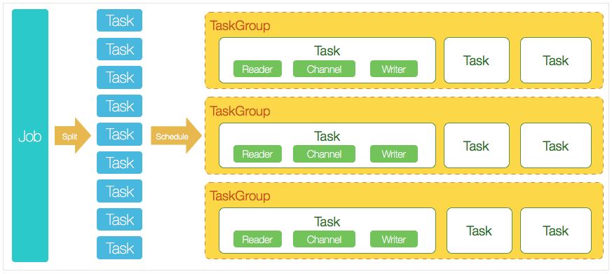

#### 简介

​	DataX是阿里巴巴开源的一个数据同步工具，适配多种数据源，将原本网状的数据同步方式，变成星型的同步方式，所有数据库同步都是先将数据传输到DataX，然后DataX将数据传输到目标数据库。

#### 整体框架

​	DataX的核心模块分为三个部分，reader、writer、framework。

​	reader负责数据收集，将源数据源的数据转发到framework中。

​	framework负责连接reader和writer，在接收到reader发送过来的数据以后，对数据进行数据转换，并处理缓冲、并发、流控等问题。

​	writer负责数据写入，framework将数据进行转换以后，write将转换后的数据写入到目标数据库。

#### 核心架构

​	Job：Job用来描述一个从源头到一个目的端的同步作业，是DataX的最小业务单元。

​	JobContainer：

​	Task：最小执行单元，将一个Job拆分成若干个Task，用于并发执行。每个Task都会有上面整体的三个部分，writer、framework、writer。

​	TaskGroup：类似于标签，用于描述一组Task，在同一个TaskGroupContainer执行下的Task集合称为TaskGroup。

​	TaskGroupContainer：任务执行容器，负责执行一组Task的工作单元。

#### 运行模式

​	与大多数中间件一样，DataX有三种运行方式，单机和分布式。

#### 参考资料

​	[DataX-github](https://github.com/alibaba/DataX/blob/master/introduction.md)

​	