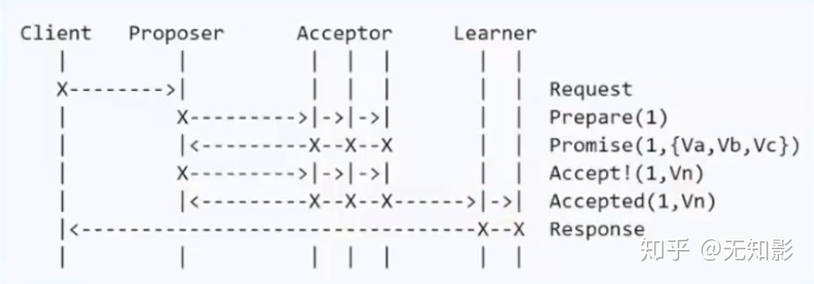

### 角色

在Paxos协议中，主要有以下几个角色

1. Proposal提案，即分布式系统的修改请求，可以表示为**[提案编号N，提案内容value]**
2. Client用户，类似社会民众，负责提出建议
3. Propser议员，类似基层人大代表，负责帮Client上交提案
4. Acceptor投票者，类似全国人大代表，负责为提案投票，**不同意比自己以前接收过的提案编号要小的提案，其他提案都同意**，例如A以前给N号提案表决过，那么再收到小于等于N号的提案时就直接拒绝了
5. Learner提案接受者，类似记录被通过提案的记录员，负责记录提案

### 达成共识的流程

1. Propser准备一个N号提案

2. Propser询问Acceptor中的多数派是否接收过N号的提案，如果都没有进入下一步，否则本提案不被考虑

3. Acceptor开始表决，Acceptor**无条件同意**从未接收过的N号提案，达到多数派同意后，进入下一步

4. Learner记录提案

   

### 活锁问题

当集群中存在多个Propser时，每个Propser都会向其他Acceptor发送提案，导致每个Acceptor会一直修改支持的提案，导致最终无法达成一直。

解决方案：只允许存在一个Propser，此时也被称为Leader。

