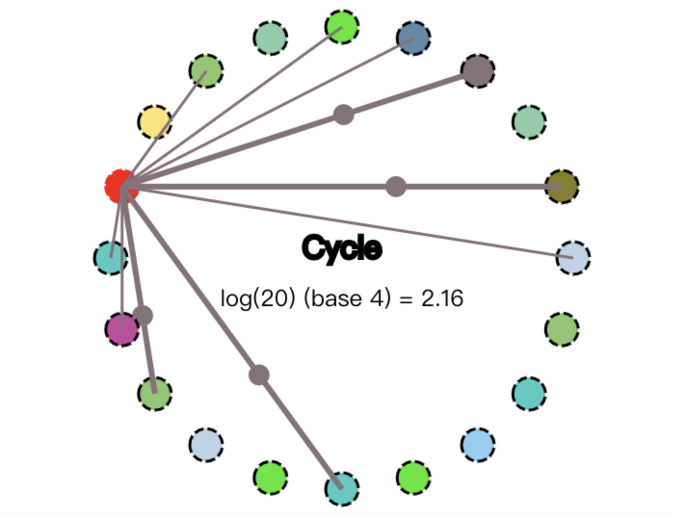
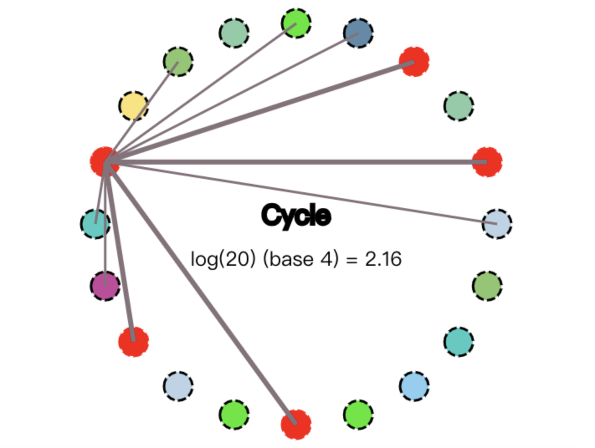
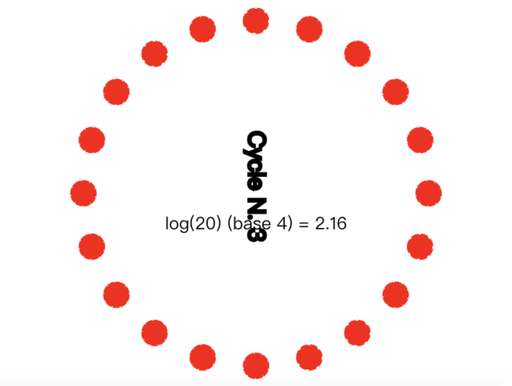

### 简介

Gossip是基于六度分隔理论的一个协议，用于传播信息，是保证最终一致性的一种协议。

#### 六度分隔理论

最开始是在社交理论中出现的，若每个人平均认识260个人，那么每个人与任意一个陌生人之间的间隔不会超过六个。

### 基本流程

当某个节点数据发生变更时，它将这次的数据变更传递给N个节点，这些节点再传递给M个节点，重复此步骤，直到所有节点都接收到数据变更的内容。

### 复杂度分析

若集群中有X个节点，每个节点传递给N个其他节点，那么时间复杂度是o(logX)。

### 容错性

假设某次数据传递时出现异常，导致N个需要传递的节点中，有部分节点没有接收到，但因为传递过程本身就存在一些重复节点，因此不需要担心因为一次的传递而导致数据的异常。

